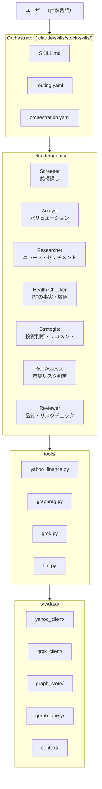

# Architecture

## System Overview

自然言語ファーストの投資分析システム。Agentic AI Pattern で設計。
ユーザーは日本語で意図を伝えるだけで、オーケストレーターが適切なエージェントを自律的に選択・起動する。

Claude Code Skills として動作し、Yahoo Finance API (yfinance) + Grok API (X/Web検索) + Neo4j (GraphRAG) + マルチLLM (Gemini/GPT/Grok) を統合。

---

## Layer Architecture



---

## Data Flow

```
1. ユーザー発言（自然言語）
   ↓
2. Orchestrator (SKILL.md)
   ├─ routing.yaml で意図→エージェントを判定
   ├─ 記録系（メモ・売買記録）→ 直接実行（action: direct）
   └─ 分析系 → エージェントをサブエージェントとして起動
   ↓
3. Agent (agent.md + examples.yaml)
   ├─ GraphRAG で過去のコンテキストを取得
   ├─ tools/ 経由でデータ取得
   ├─ 自律的に判断・計算・整形
   └─ 投資判断を伴う出力 → Reviewer を自動挿入
   ↓
4. Tools (tools/*.py)
   ├─ yahoo_finance: yfinance + 24h JSON cache
   ├─ graphrag: Neo4j GraphRAG (dual-write)
   ├─ grok: Grok API (X/Web検索)
   └─ llm: Gemini/GPT/Grok (マルチLLMレビュー)
   ↓
5. 結果表示 + GraphRAG に自動蓄積
   ↓
6. Orchestration (orchestration.yaml)
   ├─ 0件 → 条件緩和してリトライ
   ├─ Reviewer FAIL → 差し戻し
   └─ 上限到達 → 現状の結果を提示
```

---

## Design Principles

### 1. Natural Language First
ユーザーインターフェースは自然言語。`routing.yaml` がすべての入口。エージェントが自律的にパラメータを決定する。

### 2. Agentic AI Pattern
- **Orchestrator** (SKILL.md): どのエージェントを呼ぶか
- **Agents** (agent.md): 判断・計算・整形を自律実行
- **Tools** (tools/): データ取得のみ。判断しない
- **Few-shot** (examples.yaml): エージェントの行動をサンプルで示す

### 3. Dual-Write Pattern (JSON master + Neo4j view)
- JSON ファイルが master データソース（常に書き込み成功）
- Neo4j は view（検索・関連付け用）。try/except で graceful degradation
- Neo4j が落ちても全機能が動作する

### 4. Multi-LLM Review & DeepThink 4-Swarm
Reviewer エージェントが3つのLLM（GPT/Gemini/Claude）を並列で起動し、異なる視点からレビュー。APIキー未設定時は全て Claude で実行（graceful degradation）。

DeepThink モードでは **2層モデルの 4-Swarm** で評価:
- **インフラ層（固定）**: Grok=X/リアルタイム市場データ、Gemini=Google検索+長コンテキスト（ハード制約: 他LLMで代替不可）
- **推論層（動的）**: Devil's Advocate / Scenario Analyst / Lesson Auditor / Portfolio Aligner をテーマに応じて GPT/Gemini/Grok/Claude に割り当て
- Claude 自身もオーケストレーター層で推論に参加（Agent 起動不要）

### 5. Self-Healing Orchestration
orchestration.yaml に基づく自律修正ループ。スクリーニング0件→条件緩和、Reviewer FAIL→差し戻し。ユーザーに聞くのは売買の最終実行のみ。

---

## Agent Summary

| エージェント | 役割 | 使用ツール | デフォルトLLM |
|:---|:---|:---|:---|
| Screener | 銘柄探し・スクリーニング | yahoo_finance | Claude |
| Analyst | バリュエーション・割安度判定 | yahoo_finance, graphrag | Claude |
| Researcher | ニュース・センチメント・業界動向 | grok, graphrag | Grok |
| Health Checker | PFの事実・数値（判断しない） | yahoo_finance, graphrag | Claude |
| Strategist | 投資判断・レコメンド | yahoo_finance, graphrag | Claude |
| Risk Assessor | 市場リスク判定（risk-on/neutral/risk-off） | yahoo_finance, WebSearch | Claude |
| Reviewer | 品質・矛盾・リスクチェック | llm, graphrag | GPT+Gemini+Claude |

## Tool Summary

| ツール | ソース | 役割 |
|:---|:---|:---|
| yahoo_finance.py | src/data/yahoo_client/ | 株価・ファンダメンタルズ・スクリーニング |
| graphrag.py | src/data/graph_store/ + graph_query/ | Neo4j ナレッジグラフ |
| grok.py | src/data/grok_client/ | Grok API（X/Web検索） |
| llm.py | (直接API呼び出し) | Gemini/GPT/Grok マルチLLM |

## Testing & Worktree Tooling（KIK-745/746/747）

クリーン環境（API key無し・個人PFなし）でも結合試験を回せる三層構成:

```
[Layer A] Unit Tests (~1381件、autouse mock)
  python3 -m pytest tests/ -q
  → tests/conftest.py:_block_external_io が Neo4j/TEI/Grok を全自動モック

[Layer B] Dry-run (KIK-746、< 1秒)
  python3 tests/e2e/run_e2e.py --dry-run
  → src/orchestrator/dry_run.py で routing.yaml 整合性 + agent定義存在確認
  → LLM/Yahoo Finance 一切呼ばない、API key 不要

[Layer C] Mocked E2E (KIK-747、< 1秒)
  python3 -m pytest tests/e2e/test_mocked.py -q
  → pytest fixture で tools/llm.py / tools/yahoo_finance.py / tools/grok.py を stub
  → agent.md / examples.yaml は実物を使用、外部I/Oだけ差し替え

[Layer D] Real-API E2E (要 API key、~25秒)
  python3 tests/e2e/run_e2e.py
  → 実 Yahoo Finance / 実 LLM を呼ぶ最終検証
```

### Worktree フロー（KIK-745）

```
scripts/setup_worktree.sh KIK-NNN feature-name
  ├─ git worktree add -b feature/kik-NNN-feature-name ~/stock-skills-kikNNN
  ├─ tests/fixtures/sample_portfolio.csv → ~/stock-skills-kikNNN/data/portfolio.csv
  └─ tests/fixtures/sample_cash_balance.json → ~/stock-skills-kikNNN/data/cash_balance.json

⚠ 個人PF（~/stock-skills/data/portfolio.csv）を worktree に cp することは禁止。
   誤コミットでの個人銘柄リーク防止のため、汎用テスト銘柄のみ使用する。
```

